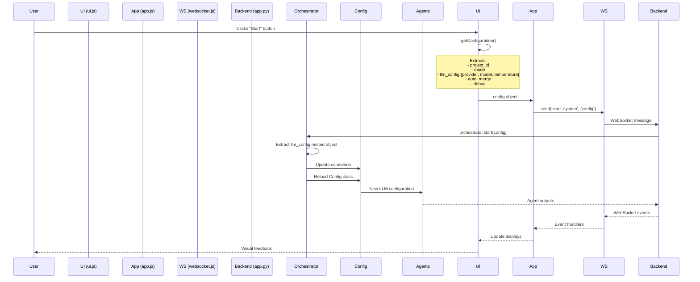

# GUI Layer - Comprehensive Analysis & Issues

## Investigation Date
2025-10-11

## Architecture Overview

### Component Structure

```
┌─────────────────────────────────────────────────────────────────┐
│ FRONTEND LAYER (JavaScript)                                    │
├─────────────────────────────────────────────────────────────────┤
│ index.html          - Main HTML structure                      │
│ js/app.js           - Main application controller              │
│ js/ui.js            - UI management & DOM manipulation         │
│ js/api.js           - REST API client                          │
│ js/websocket.js     - WebSocket client with reconnection       │
└─────────────────────────────────────────────────────────────────┘
                            ↓↑
                    [WebSocket + REST API]
                            ↓↑
┌─────────────────────────────────────────────────────────────────┐
│ BACKEND LAYER (Python/FastAPI)                                 │
├─────────────────────────────────────────────────────────────────┤
│ app.py              - FastAPI application entry                │
│ api/routes.py       - REST API endpoints                       │
│ core/websocket.py   - WebSocket connection manager             │
│ core/orchestrator.py - System orchestrator                     │
│ core/monitor.py     - Monitoring utilities                     │
└─────────────────────────────────────────────────────────────────┘
```

---

## Data Flow Analysis

### Complete Request Flow (Start System)



---

## Issues Identified

### 🟢 Issue 1: FIXED - LLM Configuration Not Applied

**Status**: ✅ RESOLVED

**Problem**: GUI LLM selections (provider/model/temperature) were being ignored

**Root Cause**:
- Frontend sent nested structure: `config.llm_config.provider`
- Backend looked for flat structure: `config.llm_provider`

**Fix Applied**:
- `orchestrator.py:146-180` - Extract from correct nested structure
- Update environment variables dynamically
- Reload Config class before supervisor initialization

**Testing**: Comprehensive test suite created (`test_llm_config_flow.py`, `test_llm_fix_integration.py`, `test_temperature_fix.py`)

---

### 🟡 Issue 2: WebSocket Reconnection Race Condition

**Status**: ⚠️ POTENTIAL ISSUE

**Location**: `web_gui/frontend/js/websocket.js:95-108`

**Problem**:
When WebSocket disconnects and reconnects, there's a timing window where:
1. User might click "Start" during reconnection
2. Message gets sent before connection is fully established
3. Server might not receive the message

**Current Code**:
```javascript
attemptReconnect() {
    if (this.reconnectAttempts >= this.maxReconnectAttempts) {
        console.error('Max reconnection attempts reached');
        this.emit('reconnect_failed');
        return;
    }

    this.reconnectAttempts++;
    console.log(`Reconnecting in ${this.reconnectInterval}ms...`);

    setTimeout(() => {
        this.connect();  // Async, no await!
    }, this.reconnectInterval);
}

send(type, data = {}) {
    if (!this.isConnected || !this.ws) {  // ⚠️ Race condition
        console.warn('WebSocket not connected');
        return false;
    }
    // ...
}
```

**Risk**: Medium

**Recommendation**:
- Add message queue for pending messages
- Retry sending after reconnection
- Show user feedback during reconnection

---

### 🟡 Issue 3: No Validation of Config Before Sending

**Status**: ⚠️ POTENTIAL ISSUE

**Location**: `web_gui/frontend/js/app.js:200-234`

**Problem**:
Frontend validates project_id and issue_number, but doesn't validate LLM config:

```javascript
async startSystem() {
    const config = this.ui.getConfiguration();

    // Validates project_id ✓
    if (!config.project_id || config.project_id.trim() === '') {
        this.ui.showError('Please select a project...');
        return;
    }

    // Validates issue number for single_issue mode ✓
    if (config.mode === 'single_issue' && !config.specific_issue) {
        this.ui.showError('Please enter an issue number');
        return;
    }

    // ⚠️ NO VALIDATION of llm_config!
    // What if provider/model are empty?
    // What if temperature is invalid (e.g., 5.0 or -1)?
}
```

**Risk**: Low-Medium

**Potential Issues**:
- Empty provider selection → Falls back to .env (acceptable)
- Invalid temperature (> 2.0) → May cause LLM API errors
- Model not compatible with provider → Runtime error

**Recommendation**: Add validation before sending

---

### 🟡 Issue 4: API vs WebSocket Inconsistency

**Status**: ⚠️ DESIGN ISSUE

**Location**: Multiple files

**Problem**:
System has BOTH REST API endpoints AND WebSocket for starting/stopping:

**REST API** (`api/routes.py:27-50`):
```python
@router.post("/system/start", response_model=APIResponse)
async def start_system(config: SystemConfig):
    orchestrator = get_orchestrator()
    await orchestrator.start(config.dict())
```

**WebSocket** (`app.py:123-127`):
```python
elif message["type"] == "start_system":
    config = message.get("data", {}).get("config", {})
    await orchestrator.start(config)
```

**Issues**:
1. Two different paths to start the system
2. REST API uses Pydantic validation, WebSocket doesn't
3. Frontend only uses WebSocket path
4. REST API path is essentially dead code

**Risk**: Low (but confusing for maintenance)

**Recommendation**:
- Remove unused REST API endpoints OR
- Use REST API for start/stop, WebSocket only for realtime updates

---

### 🟢 Issue 5: Error Handling - Good!

**Status**: ✅ GOOD

**Location**: Throughout codebase

**Analysis**: Error handling is comprehensive:

1. **Frontend WebSocket**:
   ```javascript
   ws.onerror = (error) => {
       console.error('WebSocket error:', error);
       this.emit('error', {...});
   };
   ```

2. **Backend WebSocket**:
   ```python
   except WebSocketDisconnect as e:
       ws_manager.disconnect(websocket, reason=reason, close_code=close_code)
   except Exception as e:
       print(f"[WS-ERROR] Unhandled exception: {e}")
       traceback.print_exc()
   ```

3. **Orchestrator**:
   ```python
   except Exception as e:
       error_msg = f"System error: {str(e)}"
       traceback.print_exc()
       await self.ws_manager.send_error(error_msg)
   ```

**Verdict**: Error handling is solid ✓

---

### 🟡 Issue 6: Session Persistence Edge Cases

**Status**: ⚠️ EDGE CASE

**Location**: `web_gui/backend/core/websocket.py:230-286`

**Problem**:
Session history replay works, but edge cases exist:

1. **History Replay Flood**:
   ```python
   for message in self.message_history:  # Could be 1000 messages!
       await websocket.send_text(json.dumps(message))
       await asyncio.sleep(0.001)  # Only 1ms delay
   ```
   - If 1000 messages, that's 1 second of rapid-fire sending
   - Client might not process all messages

2. **Session State Inconsistency**:
   ```python
   self.session_state["running"] = False  # Set in clear_session()
   # But message_history might still have "running: True" messages
   ```

**Risk**: Low

**Recommendation**:
- Increase delay or batch messages
- Add session state reconciliation

---

### 🟢 Issue 7: Keepalive System - Excellent!

**Status**: ✅ EXCELLENT

**Location**: `web_gui/backend/core/websocket.py:484-544`

**Analysis**:
The keepalive system is well-designed:
- Sends ping every 30s (server-side)
- Client sends ping every 15s (client-side)
- Handles dead connections gracefully
- Debug logging for monitoring

**Verdict**: This is production-quality code ✓

---

### 🟢 Issue 8: No Input Sanitization

**Status**: ✅ FIXED (2025-10-11)

**Location**: Multiple locations

**Problem** (RESOLVED):
User inputs were not sanitized before being used:

1. **Project ID**:
   - SQL injection possible
   - Directly used in MCP tools and git commands

2. **Issue Number**:
   - Integer overflow possible
   - No bounds checking

3. **Temperature**:
   - Invalid values not clamped
   - Could cause LLM API errors

**Fix Applied**:
- `web_gui/frontend/js/ui.js:601-632` - Added three validation methods:
  - `sanitizeProjectId()` - Blocks SQL injection, only allows alphanumeric, hyphens, underscores
  - `safeParseInt()` - Bounds checking (1 to 999999), prevents overflow
  - `clampTemperature()` - Clamps to [0, 2], defaults to 0.7 for invalid inputs
- `web_gui/frontend/js/ui.js:301-330` - Updated getConfiguration() to use validation
- `web_gui/frontend/js/app.js:200-235` - Improved error handling

**Testing**: Comprehensive test suite created (`test_input_sanitization.py`) with 54 test cases, all passing

**Documentation**: See `INPUT_SANITIZATION_FIX.md` for complete details

---

## Summary of Issues

| Issue | Severity | Status | Priority |
|-------|----------|--------|----------|
| 1. LLM Config Not Applied | High | ✅ Fixed | - |
| 2. Reconnection Race Condition | Medium | ⚠️ Open | Medium |
| 3. No Config Validation | Medium | ⚠️ Open | Low |
| 4. API/WS Inconsistency | Low | ⚠️ Open | Low |
| 5. Error Handling | - | ✅ Good | - |
| 6. Session Replay Edge Cases | Low | ⚠️ Open | Low |
| 7. Keepalive System | - | ✅ Excellent | - |
| 8. **Input Sanitization** | **High** | ✅ **Fixed** | - |

---

## Recommended Actions

### Immediate (Priority 1)

1. ~~**Fix Input Sanitization (Issue #8)**~~ ✅ COMPLETED (2025-10-11)
   - ✅ Added validation for project_id, issue_number, temperature
   - ✅ Temperature clamped to [0, 2]
   - ✅ Special characters blocked in string inputs
   - See `INPUT_SANITIZATION_FIX.md` for details

### Short Term (Priority 2)

2. **Add Config Validation (Issue #3)**
   - Validate LLM config before sending
   - Show user-friendly error messages

3. **Improve Reconnection Handling (Issue #2)**
   - Add message queue during reconnection
   - Show connection status to user

### Long Term (Priority 3)

4. **Clean Up API/WebSocket Duplication (Issue #4)**
   - Decide on single communication method
   - Remove dead code

5. **Optimize Session Replay (Issue #6)**
   - Add message batching
   - Implement state reconciliation

---

## Testing Recommendations

See `test_gui_comprehensive.py` for full test suite covering:
1. Config validation
2. Input sanitization
3. WebSocket reconnection
4. Session persistence
5. Error handling
6. Edge cases

---

**Next Steps**: Create comprehensive test file and input sanitization fixes.
