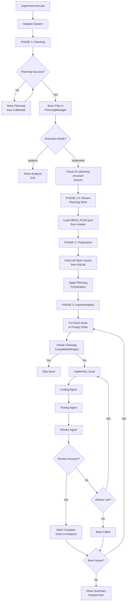
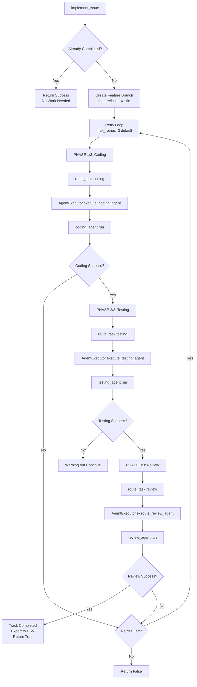

# Agent Orchestration Flow Analysis

## Overview
This document explains how the Supervisor orchestrates agents, selects issues, and coordinates the implementation workflow.

---

## 🔄 **Main Execution Flow**



---

## 📋 **Issue Selection & Prioritization**

### **Step 1: Fetch All Open Issues**
```python
# supervisor.py line 460
all_gitlab_issues = await self.issue_manager.fetch_gitlab_issues()
# Returns ALL open issues from GitLab API
```

### **Step 2: Apply Planning Prioritization**
```python
# supervisor.py line 470
issues = await self.planning_manager.apply_planning_prioritization(
    all_gitlab_issues,
    self.planning_manager.get_current_plan(),
    self.issue_manager.is_issue_completed
)
```

**Prioritization Strategy (Priority Order):**

1. **ORCH_PLAN.json implementation_order** (Highest Priority)
   - Planning Agent creates `docs/ORCH_PLAN.json` with:
   ```json
   {
     "implementation_order": [
       {"issue_id": "5", "priority": 1, "dependencies": []},
       {"issue_id": "3", "priority": 2, "dependencies": ["5"]},
       {"issue_id": "7", "priority": 3, "dependencies": ["3", "5"]}
     ]
   }
   ```
   - Issues implemented in this exact order
   - Respects dependencies (issue 3 waits for issue 5)

2. **Dependency-Based Ordering** (Fallback)
   - If ORCH_PLAN.json not found, analyze issue descriptions
   - Extract dependencies: "Depends on #5", "Requires #3"
   - Sort issues so dependencies are implemented first

3. **Label-Based Prioritization** (Fallback)
   - Priority labels: `priority::high`, `priority::critical`
   - Type labels: `type::bug` (higher priority than features)

4. **Creation Date** (Final Fallback)
   - Oldest issues first (FIFO)

### **Step 3: Filter Completed Issues**
```python
# planning_manager.py line 62-68
for issue in prioritized_issues:
    if await is_completed_func(issue):
        print(f"[SKIP] Issue #{issue_iid} already completed/merged")
        continue
    filtered_issues.append(issue)
```

**Completion Check Logic:**
- Issue state is "closed" AND merge request exists and is merged
- OR: Merge request merged but issue still open (manual closure pending)
- Prevents re-implementing already completed work

---

## 🎯 **Single Issue vs All Issues Mode**

### **Mode 1: Implement All Issues**
```bash
python orchestrator_run.py --mode implement
```
```python
# supervisor.py line 505
issues_to_implement = issues  # All prioritized issues
```
**Behavior:**
- Fetches all open issues from GitLab
- Prioritizes using ORCH_PLAN.json or fallback
- Implements issues **sequentially** in priority order
- 3 second pause between issues (line 537)

### **Mode 2: Single Issue**
```bash
python orchestrator_run.py --mode single --issue 5
```
```python
# supervisor.py line 496-503
issues_to_implement = [
    i for i in issues
    if str(i.get("iid")) == str(specific_issue)
]
```
**Behavior:**
- Still fetches all issues (for context/dependencies)
- Filters to only the specified issue
- Implements just that one issue
- Respects completion check (skip if already done)

---

## 🔁 **Per-Issue Implementation Loop**



---

## 🤖 **Agent Invocation Details**

### **Coding Agent Invocation**
```python
# supervisor.py line 252-256
coding_result = await self.route_task(
    "coding",
    issue=issue,         # Full issue dict from GitLab
    branch=feature_branch  # e.g., "feature/issue-5-user-auth"
)
```

**What Coding Agent Receives:**
```python
# agent_executor.py -> execute_coding_agent
{
    "project_id": "12345",
    "work_branch": "feature/issue-5-user-auth",
    "issues": ["5"],  # List with single issue IID
    "plan_json": {...},  # ORCH_PLAN.json content
    "tools": [<MCP tools>],
    "pipeline_config": {
        "tech_stack": {"backend": "python", "frontend": None},
        "config": {...}
    }
}
```

**What Coding Agent Must Do:**
1. Check `docs/reports/` for retry scenario (PHASE 0)
2. If RETRY_AFTER_REVIEW: Read review report, fix specific issues
3. If FRESH_START: Full implementation from scratch
4. Create source files in `src/` directory
5. Monitor pipeline until compilation succeeds
6. Create agent report: `docs/reports/CodingAgent_Issue#5_Report_v1.md`
7. Signal completion: `CODING_PHASE_COMPLETE`

---

### **Testing Agent Invocation**
```python
# supervisor.py line 270-274
testing_result = await self.route_task(
    "testing",
    issue=issue,
    branch=feature_branch
)
```

**What Testing Agent Receives:**
```python
{
    "project_id": "12345",
    "work_branch": "feature/issue-5-user-auth",
    "issues": ["5"],
    "plan_json": {...},
    "tools": [<MCP tools>],
    "pipeline_config": {...}
}
```

**What Testing Agent Must Do:**
1. Check `docs/reports/` for context (PHASE 0)
   - If CodingAgent report exists: Read to understand implementation
   - If TestingAgent report exists (retry): Debug test failures
2. Fetch issue with `get_issue()` to extract acceptance criteria
3. Create test files in `tests/` directory
4. Map each acceptance criterion to specific tests
5. Monitor pipeline until tests execute and pass
6. Create agent report: `docs/reports/TestingAgent_Issue#5_Report_v1.md`
7. Signal completion: `TESTING_PHASE_COMPLETE`

---

### **Review Agent Invocation**
```python
# supervisor.py line 288-292
review_result = await self.route_task(
    "review",
    issue=issue,
    branch=feature_branch
)
```

**What Review Agent Receives:**
```python
{
    "project_id": "12345",
    "work_branch": "feature/issue-5-user-auth",
    "issue_iid": "5",
    "tools": [<MCP tools>],
    "pipeline_config": {...}
}
```

**What Review Agent Must Do:**
1. Get latest pipeline for feature branch
2. Verify pipeline status === "success"
3. Analyze test results from pipeline jobs
4. If tests failed: Create detailed failure report for Coding Agent
5. If tests passed: Create and merge MR to master
6. Close issue after successful merge
7. Create agent report: `docs/reports/ReviewAgent_Issue#5_Report_v1.md`
8. Signal completion: `REVIEW_PHASE_COMPLETE`

---

## 🔄 **Retry & Error Handling**

### **Issue-Level Retries**
```python
# supervisor.py line 236
for attempt in range(retries):  # Default: 3 retries
```

**Retry Triggers:**
- Coding Agent fails (compilation errors)
- Testing Agent fails (test creation issues)
- Review Agent fails (pipeline failures, merge conflicts)

**What Happens on Retry:**
1. Wait with exponential backoff: `retry_delay * attempt` seconds
2. Re-run entire issue (Coding → Testing → Review)
3. Agents detect retry scenario via `docs/reports/` existence
4. Agents apply targeted fixes instead of starting from scratch

### **Agent-Specific Retry Logic**

**Coding Agent Retry:**
- Detects `ReviewAgent_Issue#5_Report_v1.md` exists
- Scenario = `RETRY_AFTER_REVIEW`
- Reads report for specific test failures
- Applies targeted fixes to existing files
- Increments report version: `v1 → v2 → v3`

**Testing Agent Retry:**
- Detects `TestingAgent_Issue#5_Report_v1.md` exists
- Scenario = `RETRY_TESTS_FAILED`
- Analyzes: Are tests correct or incorrect?
- If tests incorrect: Fix test assertions
- If tests correct: Report implementation issues (no changes)

---

## 📊 **Success Detection**

### **Completion Signals**
Each agent must signal completion with exact keyword:

```python
# coding_agent.py
return "CODING_PHASE_COMPLETE: Issue #5 implementation finished..."

# testing_agent.py
return "TESTING_PHASE_COMPLETE: Issue #5 tests finished..."

# review_agent.py
return "REVIEW_PHASE_COMPLETE: Issue #5 merged successfully..."
```

### **Success Verification**
```python
# agent_executor.py line 89
success, confidence, reason = CompletionMarkers.check_completion(agent_type, result)
```

**Detection Strategy:**
1. Look for exact completion signal (e.g., `CODING_PHASE_COMPLETE`)
2. Check for failure markers (e.g., `COMPILATION_FAILED`, `TESTS_FAILED`)
3. Agent-specific logic:
   - Coding: Only fail on `COMPILATION_FAILED` (ignore test failures)
   - Testing: Fail on `TESTS_FAILED` or `PIPELINE_FAILED`
   - Review: Fail on `PIPELINE_FAILED` or `MERGE_BLOCKED`

---

## 🎯 **Critical Workflow Rules**

### **1. Sequential Agent Execution**
- **NEVER run agents in parallel for same issue**
- Order: Planning → Coding → Testing → Review
- Each agent waits for previous to complete

### **2. Pipeline ID Tracking**
```python
# agent_executor.py line 43-47
self.testing_pipeline_id = None  # Testing Agent's pipeline
self.current_pipeline_id = None  # Review Agent must match
```
**Critical Fix:** Review Agent must validate Testing Agent's pipeline, not create new one

### **3. Branch Discipline**
- Each issue gets unique feature branch: `feature/issue-{iid}-{title}`
- All agents work on SAME branch
- NEVER work on master/main directly
- All file operations: `ref=work_branch`

### **4. Issue Skipping Logic**
```python
# supervisor.py line 221-226
is_completed = await self.issue_manager.is_issue_completed(issue)
if is_completed:
    print(f"[SKIP] Issue already completed - skipping")
    return True  # Success without doing work
```
**Prevents:**
- Re-implementing closed issues
- Re-implementing merged but unclosed issues
- Wasted agent execution cycles

### **5. Report Version Tracking**
- First attempt: `CodingAgent_Issue#5_Report_v1.md`
- Second attempt (retry): `CodingAgent_Issue#5_Report_v2.md`
- Third attempt (final): `CodingAgent_Issue#5_Report_v3.md`
- Each agent reads LATEST report to understand previous failures

---

## 📈 **Analytics & Tracking**

### **Per-Run Tracking**
```python
# supervisor.py line 78
self.run_logger = RunLogger(project_id, config)
```
**Tracks:**
- Run ID (UUID)
- Start/end timestamps
- LLM configuration (provider, model, temperature)
- Execution mode (implement/analyze/single)
- Total issues attempted/completed/failed

### **Per-Issue Tracking**
```python
# supervisor.py line 229
self.current_issue_tracker = IssueTracker(run_id, issue_iid)
```
**Tracks:**
- Issue IID
- Agent invocations (coding, testing, review)
- Pipeline IDs used
- Error details
- Duration per phase
- Final status (completed/failed)

### **Export to CSV**
```python
# supervisor.py line 302, 328
self.csv_exporter.export_issue(run_id, issue_report)
```
**Location:** `logs/run_{run_id}_issues.csv`
**Contains:** Detailed metrics per issue for analysis

---

## 🚨 **Common Issues & Solutions**

### **Issue: Wrong Implementation Order**
**Problem:** Dependencies not respected, issue 3 implemented before issue 5
**Solution:** Ensure `ORCH_PLAN.json` exists with correct `implementation_order`

### **Issue: Infinite Retry Loop**
**Problem:** Agents keep retrying same failure
**Solution:** Check max_retries limit (default: 3), agents must fix root cause

### **Issue: Pipeline ID Mismatch**
**Problem:** Review Agent validates wrong pipeline
**Solution:** Use `self.testing_pipeline_id` consistently

### **Issue: Issues Re-Implemented**
**Problem:** Completed issues processed again
**Solution:** Fix `is_issue_completed()` logic, check both issue state AND MR merge status

---

## 📝 **Execution Example**

```bash
# Start full orchestration
python orchestrator_run.py --mode implement --project 12345

# Output:
# [SUPERVISOR] Initialized for project 12345
# [PHASE 1: PLANNING]
# [PLANNING] Created ORCH_PLAN.json with 8 issues
# [PLANNING] Implementation order: [5, 3, 7, 2, 9, 1, 4, 8]
#
# [PHASE 2: PREPARATION]
# [ISSUES] Found 8 open issues
# [ISSUES] After prioritization: 8 issues to implement
#   - Issue #5: User Authentication
#   - Issue #3: Project CRUD API
#   - Issue #7: Task Management
#   ...
#
# [PHASE 3: IMPLEMENTATION]
# [PROGRESS] 1/8
# [ISSUE #5] Phase 1/3: Coding...
# [CODING] Implementing issue #5: User Authentication
# [CODING] Created src/api/auth.py
# [CODING] Pipeline #4259: success
# [CODING] CODING_PHASE_COMPLETE
#
# [ISSUE #5] Phase 2/3: Testing...
# [TESTING] Creating tests for issue #5
# [TESTING] Created tests/test_api_auth.py
# [TESTING] Pipeline #4260: success
# [TESTING] TESTING_PHASE_COMPLETE
#
# [ISSUE #5] Phase 3/3: Review & MR...
# [REVIEW] Validating pipeline #4260
# [REVIEW] Creating merge request
# [REVIEW] Merged to master
# [REVIEW] REVIEW_PHASE_COMPLETE
#
# [SUCCESS] Issue #5 completed
#
# [PROGRESS] 2/8
# [ISSUE #3] Phase 1/3: Coding...
# ...
```

---

## 🔍 **Key Takeaways**

1. **Planning Agent sets the order** via ORCH_PLAN.json
2. **Issues processed sequentially** in priority order
3. **Each issue goes through 3 phases**: Coding → Testing → Review
4. **Agents coordinate via reports** in `docs/reports/`
5. **Retry logic preserves context** (agents detect retry scenario)
6. **Completion checks prevent duplicate work**
7. **Pipeline ID tracking ensures correctness**
8. **Analytics track everything** for debugging and optimization
