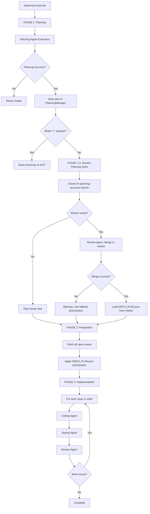

# Planning Phase Merge Flow Analysis

## 🔍 **Question**: What happens after Planning Agent completes?

This document explains **exactly** what the Supervisor and Agent Executor do after the Planning Agent finishes, and whether other agents run during the planning phase.

---

## 📊 **Complete Flow Diagram**



---

## ⚙️ **Detailed Step-by-Step Flow**

### **PHASE 1: Planning Agent Execution**

**Location:** `supervisor.py:392-428`

```python
# supervisor.py line 392-418
self.state = ExecutionState.PLANNING
print("PHASE 1: PLANNING & ANALYSIS")

# Execute Planning Agent
success = await self.planning_manager.execute_planning_with_retry(
    self.route_task,
    apply_changes  # True for "implement" mode, False for "analyze" mode
)

if not success:
    print("[ERROR] Planning analysis failed")
    self.state = ExecutionState.FAILED
    return

# Store planning result
self.planning_manager.store_plan(self.executor.current_plan)
```

**What Happens:**
1. Supervisor sets state to `PLANNING`
2. Calls `planning_manager.execute_planning_with_retry()`
3. Planning Manager delegates to `self.route_task("planning", ...)`
4. Supervisor routes to `AgentExecutor.execute_planning_agent()`
5. Agent Executor runs `planning_agent.run()`

**Planning Agent's Job:**
- Analyzes all GitLab issues
- Extracts dependencies from issue descriptions
- Creates topological implementation order
- Creates `planning-structure` branch
- Creates `docs/ORCH_PLAN.json` on that branch
- Signals `PLANNING_PHASE_COMPLETE`

**Planning Agent Does NOT:**
- ❌ Create src/ directory or implementation files
- ❌ Create tests/ directory or test files
- ❌ Run Coding/Testing/Review agents
- ❌ Merge the planning branch (Review Agent's job)

---

### **MODE CHECK: Analyze vs Implement**

**Location:** `supervisor.py:430-434`

```python
if mode == "analyze":
    print("[COMPLETE] Analysis done. Run with --apply to implement.")
    self.state = ExecutionState.COMPLETED
    await self.show_summary()
    return  # EXIT HERE - no implementation
```

**Decision Point:**
- **Mode = "analyze"**: Planning Agent runs, shows analysis, **EXITS** (no implementation)
- **Mode = "implement"**: Planning Agent runs, **CONTINUES** to PHASE 1.5

---

### **PHASE 1.5: Review Planning Work (Critical Merge Step)**

**Location:** `supervisor.py:436-504`

This is the **automatic merge** of the planning-structure branch!

```python
# supervisor.py line 438-477
print("Step 3: Checking for planning-structure branch")

# Fetch all branches from GitLab
branches = await self.mcp.run_tool("list_branches", {
    "project_id": str(self.project_id)
})

# Check if planning-structure branch exists
planning_branch_exists = False
for branch in branches:
    if branch.get('name', '').startswith('planning-structure'):
        planning_branch_exists = True
        planning_branch = branch.get('name')
        print(f"✅ Found planning-structure branch: {planning_branch}")
        break

if planning_branch_exists:
    print("PHASE 1.5: REVIEW PLANNING WORK")
    print("Step 4: Review Agent merging planning branch to master")

    # 🔥 CRITICAL: Review Agent is called to merge planning branch
    review_success = await self.route_task(
        "review",
        issue={"iid": "planning", "title": "Planning Structure Merge"},
        branch=planning_branch
    )

    if review_success:
        print("✅ Planning branch merged to master successfully")

        # Load ORCH_PLAN.json from master after successful merge
        print("Step 5: Loading ORCH_PLAN.json from master")
        plan_loaded = await self.planning_manager.load_plan_from_repository(
            self.mcp,
            self.project_id,
            ref="master"  # Read from master, not planning branch!
        )

        if plan_loaded:
            print("✅ ORCH_PLAN.json loaded successfully")
            plan = self.planning_manager.get_current_plan()
            order = plan['implementation_order']
            print(f"Implementation order: {[item.get('issue_id') for item in order]}")
    else:
        print("⚠️ Planning branch merge FAILED - using fallback")
```

**What Happens:**

1. **Step 3:** Supervisor checks if `planning-structure` branch exists
2. **Step 4:** If branch exists, **Review Agent is called immediately**
   - Issue: `{"iid": "planning", "title": "Planning Structure Merge"}`
   - Branch: `planning-structure`
   - Review Agent validates the planning-structure branch
   - Review Agent creates MR: `planning-structure` → `master`
   - Review Agent merges the MR
3. **Step 5:** After successful merge, load `docs/ORCH_PLAN.json` from `master` branch

**Review Agent's Special Job During Planning Phase:**
- Validate planning-structure branch exists
- Create merge request to master
- Merge MR (no pipeline validation needed for planning docs)
- Close the planning MR

**CRITICAL:** Review Agent runs **ONCE** here, not per issue. This is a special invocation just to merge the planning docs.

---

### **PHASE 2: Implementation Preparation**

**Location:** `supervisor.py:506-532`

```python
print("PHASE 2: IMPLEMENTATION PREPARATION")

# Fetch all open issues from GitLab
print("Step 6: Fetching all open issues from GitLab")
all_gitlab_issues = await self.issue_manager.fetch_gitlab_issues()

print(f"✅ Fetched {len(all_gitlab_issues)} open issues")
```

**What Happens:**
1. Fetch ALL open issues from GitLab API
2. At this point, ORCH_PLAN.json is already on master branch
3. No agents are executed - just data fetching

---

### **PHASE 3: Implementation Loop (Per-Issue)**

**Location:** `supervisor.py:533+` (not shown in excerpt, but documented in ORCHESTRATION_FLOW_ANALYSIS.md)

```python
# For each issue in prioritized order
for issue in issues_to_implement:
    # Coding Agent for this issue
    await self.route_task("coding", issue=issue, branch=feature_branch)

    # Testing Agent for this issue
    await self.route_task("testing", issue=issue, branch=feature_branch)

    # Review Agent for this issue
    await self.route_task("review", issue=issue, branch=feature_branch)
```

**What Happens:**
1. For **each issue** in ORCH_PLAN.json implementation order:
   - **Coding Agent** creates implementation files on `feature/issue-X` branch
   - **Testing Agent** creates test files on same branch
   - **Review Agent** validates pipeline, creates MR, merges to master
2. Repeat for next issue

---

## 🎯 **Key Questions Answered**

### **Q1: Does the planning-structure branch get merged right after Planning Agent finishes?**

**A:** ✅ **YES!** Immediately after Planning Agent completes in "implement" mode:
- PHASE 1.5 kicks in automatically
- Review Agent is called to merge `planning-structure` → `master`
- ORCH_PLAN.json becomes available on master branch

**Code Reference:** `supervisor.py:436-477`

---

### **Q2: Do other agents (Coding/Testing) run during the planning phase?**

**A:** ❌ **NO!** Only two agents run during planning:
1. **Planning Agent** - Creates ORCH_PLAN.json on planning-structure branch
2. **Review Agent** - Merges planning-structure branch to master (PHASE 1.5)

**Coding and Testing Agents do NOT run until PHASE 3 (per-issue implementation).**

**Code Reference:**
- Planning: `supervisor.py:392-428`
- Review (merge): `supervisor.py:456-477`
- Coding/Testing: PHASE 3 (per-issue loop)

---

### **Q3: What does the Supervisor do?**

**A:** Supervisor orchestrates the entire workflow:

**During Planning Phase:**
1. Calls Planning Agent via `planning_manager.execute_planning_with_retry()`
2. Stores planning result in `planning_manager`
3. Checks if mode == "analyze" → if yes, exits early
4. Checks for `planning-structure` branch
5. If branch exists, calls Review Agent to merge it to master
6. Loads ORCH_PLAN.json from master branch

**During Implementation Phase:**
1. Fetches all issues from GitLab
2. Applies ORCH_PLAN.json prioritization
3. For each issue in order, calls Coding → Testing → Review agents
4. Tracks progress and analytics

**Code Reference:** `supervisor.py:364-532`

---

### **Q4: What does the Agent Executor do?**

**A:** Agent Executor handles the actual execution of each agent:

**For Planning Agent:**
```python
# agent_executor.py line 127-180
async def execute_planning_agent(self, apply: bool = False):
    # Execute planning agent with 10 minute timeout
    result = await asyncio.wait_for(
        planning_agent.run(
            project_id=self.project_id,
            tools=self.tools,
            apply=apply,
            pipeline_config=self.tech_stack
        ),
        timeout=600  # 10 minutes
    )

    # Process and validate result
    success = await self._process_planning_result(result)

    return success
```

**Validation Logic:**
- Checks for `PLANNING_PHASE_COMPLETE` signal
- Optionally checks for `BASELINE_VERIFIED` (if .gitlab-ci.yml exists)
- Stores planning result in `self.current_plan`

**For Coding/Testing/Review Agents:**
- Similar execution pattern
- Different success criteria per agent type
- Pipeline ID tracking for Testing/Review agents

**Code Reference:** `agent_executor.py:127-244`

---

## 📋 **Complete Execution Timeline**

| Time | Phase | Agent | Action | Branch |
|------|-------|-------|--------|--------|
| T0 | PHASE 1 | Planning | Analyze issues, create ORCH_PLAN.json | `planning-structure` |
| T1 | PHASE 1 | - | Store plan in PlanningManager | - |
| T2 | PHASE 1.5 | Review | Merge planning-structure → master | `master` |
| T3 | PHASE 1.5 | - | Load ORCH_PLAN.json from master | `master` |
| T4 | PHASE 2 | - | Fetch all GitLab issues | - |
| T5 | PHASE 2 | - | Apply ORCH_PLAN.json prioritization | - |
| T6 | PHASE 3 | Coding | Implement Issue #1 | `feature/issue-1-...` |
| T7 | PHASE 3 | Testing | Test Issue #1 | `feature/issue-1-...` |
| T8 | PHASE 3 | Review | Merge Issue #1 → master | `master` |
| T9 | PHASE 3 | Coding | Implement Issue #2 | `feature/issue-2-...` |
| ... | ... | ... | ... | ... |

---

## 🚨 **Critical Workflow Rules**

### **Rule 1: Review Agent Runs TWICE (Different Purposes)**

1. **During PHASE 1.5 (Planning Merge):**
   - Purpose: Merge `planning-structure` → `master`
   - Issue: `{"iid": "planning", "title": "Planning Structure Merge"}`
   - No pipeline validation (just docs)
   - Runs ONCE per orchestration run

2. **During PHASE 3 (Per-Issue Implementation):**
   - Purpose: Merge `feature/issue-X` → `master`
   - Issue: Actual GitLab issue
   - Full pipeline validation required
   - Runs ONCE per issue

**Code References:**
- Planning merge: `supervisor.py:466-470`
- Issue merge: PHASE 3 loop

---

### **Rule 2: Planning Agent Never Merges Its Own Branch**

Planning Agent's responsibility ends after creating `docs/ORCH_PLAN.json` on `planning-structure` branch.

**Separation of Concerns:**
- Planning Agent: Create plan
- Review Agent: Merge plan to master

This ensures proper validation and MR tracking.

---

### **Rule 3: ORCH_PLAN.json Must Be On Master Before Implementation**

Implementation (PHASE 3) cannot start until:
1. Planning Agent creates ORCH_PLAN.json
2. Review Agent merges planning-structure to master
3. Supervisor loads ORCH_PLAN.json from master

**Why:** All agents need access to the implementation order, and they read from master branch.

---

## ✅ **Summary**

**After Planning Agent completes:**

1. ✅ **Planning-structure branch IS merged immediately** (PHASE 1.5)
   - Review Agent is called automatically
   - Merges planning-structure → master
   - ORCH_PLAN.json becomes available on master

2. ❌ **Coding/Testing Agents do NOT run during planning phase**
   - They only run in PHASE 3 (per-issue implementation)
   - Planning phase = Planning Agent + Review Agent (merge only)

3. 🔄 **Supervisor orchestrates the flow:**
   - PHASE 1: Planning Agent execution
   - PHASE 1.5: Review Agent merges planning branch
   - PHASE 2: Fetch and prioritize issues
   - PHASE 3: Per-issue Coding → Testing → Review loop

4. ⚙️ **Agent Executor handles agent execution:**
   - Runs agents with timeout protection
   - Validates agent success using completion markers
   - Tracks pipeline IDs between agents
   - Records analytics per agent

**The workflow is highly structured and sequential, ensuring each phase completes before the next begins.**
