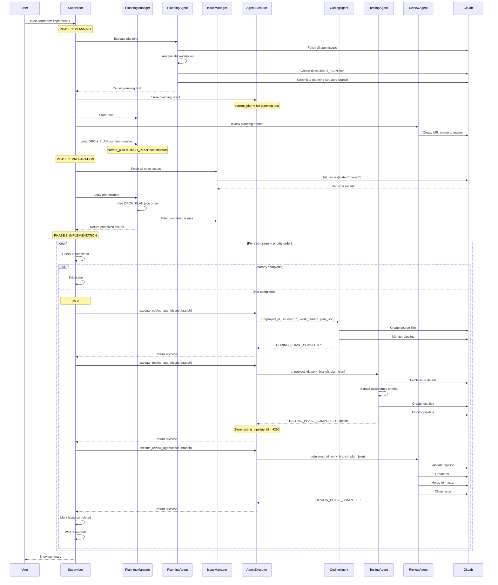

# Supervisor Instruction Flow: Deep Dive Analysis

## Overview
This document traces the **exact data flow** from supervisor initialization through to agent execution, showing precisely how agents are instructed with which issues and in what order.

---

## 🎬 **Complete Execution Flow**



---

## 📋 **PHASE 1: Planning - Creating ORCH_PLAN.json**

### **Step 1: Planning Agent Execution**

```python
# supervisor.py line 369
success = await self.planning_manager.execute_planning_with_retry(
    self.route_task,
    apply_changes=True  # mode="implement"
)
```

**What Happens:**
```python
# Calls route_task("planning", apply=True)
# Which calls agent_executor.execute_planning_agent(apply=True)
# Which calls planning_agent.run(project_id, tools, apply=True)
```

### **Step 2: Planning Agent Creates Plan**

**Planning Agent receives:**
```python
{
    "project_id": "12345",
    "tools": [<MCP tools for GitLab API>],
    "apply": True,  # Actually create files
    "pipeline_config": {
        "tech_stack": {"backend": "python", "frontend": None},
        "config": {...}
    }
}
```

**Planning Agent does:**
1. Fetches all open issues from GitLab
2. Analyzes dependencies from issue descriptions
3. Creates implementation order
4. Generates `docs/ORCH_PLAN.json`:

```json
{
  "project_id": "12345",
  "created_at": "2025-10-09T10:30:00Z",
  "total_issues": 8,
  "implementation_order": [
    {
      "issue_id": "5",
      "priority": 1,
      "title": "User Authentication",
      "dependencies": [],
      "estimated_effort": "medium"
    },
    {
      "issue_id": "3",
      "priority": 2,
      "title": "Project CRUD API",
      "dependencies": ["5"],
      "estimated_effort": "high"
    },
    {
      "issue_id": "7",
      "priority": 3,
      "title": "Task Management",
      "dependencies": ["3", "5"],
      "estimated_effort": "high"
    }
  ],
  "tech_stack": {
    "backend": "python",
    "framework": "fastapi",
    "database": "postgresql"
  }
}
```

5. Commits to `planning-structure` branch
6. Returns planning analysis text

### **Step 3: Store Planning Result**

```python
# agent_executor.py line 477-479
if result and not self.current_plan:
    self.current_plan = result  # Store full planning text
    print("[AGENT EXECUTOR] Stored planning analysis for issue prioritization")
```

**At this point:**
- `agent_executor.current_plan` = Full planning agent output (text)
- File `docs/ORCH_PLAN.json` exists on `planning-structure` branch

### **Step 4: Review Planning Branch**

```python
# supervisor.py line 413-420
review_success = await self.route_task(
    "review",
    issue={"iid": "planning", "title": "Planning & Structure"},
    branch=planning_branch
)
```

**Review Agent:**
- Validates pipeline for planning branch
- Creates MR: `planning-structure → master`
- Merges the planning branch
- Now `docs/ORCH_PLAN.json` is on master

### **Step 5: Load ORCH_PLAN.json**

```python
# supervisor.py line 429-434
plan_loaded = await self.planning_manager.load_plan_from_repository(
    self.mcp,
    self.project_id,
    ref="master"
)
```

```python
# planning_manager.py line 359-405
async def load_plan_from_repository(...):
    # Get file from master
    result = await mcp_client.run_tool("get_file_contents", {
        "project_id": str(project_id),
        "file_path": "docs/ORCH_PLAN.json",
        "ref": "master"
    })

    # Parse JSON
    plan_json = json.loads(result)

    # Store in planning_manager
    self.current_plan = plan_json  # ← Now it's the JSON structure!

    return True
```

**Now:**
- `planning_manager.current_plan` = ORCH_PLAN.json structure (dict)
- `agent_executor.current_plan` = Still the original planning text

---

## 📊 **PHASE 2: Preparation - Fetching & Prioritizing Issues**

### **Step 1: Fetch All Open Issues**

```python
# supervisor.py line 459-460
all_gitlab_issues = await self.issue_manager.fetch_gitlab_issues()
```

**What happens:**
```python
# issue_manager.py line 74-109
async def fetch_gitlab_issues(self):
    list_issues_tool = self._get_tool('list_issues')

    response = await list_issues_tool.ainvoke({
        "project_id": self.project_id,
        "state": "opened"  # Only open issues
    })

    issues = json.loads(response)
    self.gitlab_issues = issues
    return issues
```

**Example response from GitLab:**
```python
[
    {
        "id": 12345,
        "iid": 5,
        "title": "Implement User Authentication",
        "description": "...\nAkzeptanzkriterien:\n- User can login\n- Invalid credentials return 401\n...",
        "state": "opened",
        "labels": ["feature", "priority::high"],
        "created_at": "2025-10-01T10:00:00Z",
        "author": {...},
        "assignee": {...}
    },
    {
        "id": 12346,
        "iid": 3,
        "title": "Project CRUD API",
        "description": "...\nVoraussetzungen:\n- Issue #5 (User authentication)\n...",
        "state": "opened",
        "labels": ["feature"],
        "created_at": "2025-10-02T11:00:00Z"
    }
    # ... more issues
]
```

### **Step 2: Apply Planning Prioritization**

```python
# supervisor.py line 470-474
issues = await self.planning_manager.apply_planning_prioritization(
    all_gitlab_issues,
    self.planning_manager.get_current_plan(),  # ← ORCH_PLAN.json dict
    self.issue_manager.is_issue_completed
)
```

**What happens:**
```python
# planning_manager.py line 37-70
async def apply_planning_prioritization(...):
    # Check if planning_result has implementation_order
    if planning_result and isinstance(planning_result, dict):
        if 'implementation_order' in planning_result:
            # Use ORCH_PLAN.json order
            prioritized_issues = self.parse_implementation_order(
                planning_result,
                all_issues
            )
```

**parse_implementation_order:**
```python
# planning_manager.py line 104-127
def parse_implementation_order(self, plan_json, all_issues):
    # Build map: issue_iid -> issue_dict
    issue_map = {str(issue.get('iid')): issue for issue in all_issues}

    prioritized = []
    for item in plan_json['implementation_order']:
        issue_id = str(item.get('issue_id'))
        if issue_id in issue_map:
            prioritized.append(issue_map[issue_id])

    # Result: [issue_5_dict, issue_3_dict, issue_7_dict, ...]
    return prioritized
```

### **Step 3: Filter Completed Issues**

```python
# planning_manager.py line 62-69
filtered_issues = []
for issue in prioritized_issues:
    if await is_issue_completed(issue):
        print(f"[SKIP] Issue #{issue_iid} already completed/merged")
        continue
    filtered_issues.append(issue)

return filtered_issues
```

**is_issue_completed check:**
```python
# issue_manager.py line 111-145
async def is_issue_completed(self, issue):
    # Check if there's a MERGED MR for this issue
    feature_branch = self.create_feature_branch_name(issue)

    mrs = await list_merge_requests(
        source_branch=feature_branch,
        state="merged"
    )

    if mrs and len(mrs) > 0:
        return True  # Branch was merged = completed

    return False
```

**Final result:**
```python
# List of issue dicts in priority order, excluding completed ones
issues_to_implement = [
    {"iid": 5, "title": "User Authentication", ...},
    {"iid": 3, "title": "Project CRUD API", ...},
    {"iid": 7, "title": "Task Management", ...}
]
```

---

## 🔄 **PHASE 3: Implementation - Per-Issue Execution**

### **Main Loop**

```python
# supervisor.py line 515-538
for idx, issue in enumerate(issues_to_implement, 1):
    issue_iid = get_issue_iid(issue)

    print(f"\n[PROGRESS] {idx}/{len(issues_to_implement)}")

    # Implement this issue
    success = await self.implement_issue(issue)

    if success:
        print(f"[SUCCESS] Issue #{issue_iid} completed")
    else:
        self.issue_manager.track_failed_issue(issue)

    # Pause between issues
    if idx < len(issues_to_implement):
        await asyncio.sleep(3)  # 3 second pause
```

---

## 🎯 **Per-Issue Implementation: Issue #5**

### **implement_issue() Flow**

```python
# supervisor.py line 207-331
async def implement_issue(self, issue: Dict, max_retries: int = None):
    issue_iid = get_issue_iid(issue)  # 5
    issue_title = issue.get("title")   # "User Authentication"

    # Check if already completed
    is_completed = await self.issue_manager.is_issue_completed(issue)
    if is_completed:
        print(f"[SKIP] Issue #{issue_iid} already merged")
        return True

    # Create feature branch
    feature_branch = self.issue_manager.create_feature_branch_name(issue)
    # Result: "feature/issue-5-user-authentication"

    # Retry loop (max 3 attempts)
    for attempt in range(max_retries):
        try:
            # PHASE 1/3: Coding
            coding_result = await self.route_task(
                "coding",
                issue=issue,      # Full issue dict
                branch=feature_branch
            )

            if not coding_result:
                continue  # Retry

            # PHASE 2/3: Testing
            testing_result = await self.route_task(
                "testing",
                issue=issue,
                branch=feature_branch
            )

            # PHASE 3/3: Review
            review_result = await self.route_task(
                "review",
                issue=issue,
                branch=feature_branch
            )

            if review_result:
                self.issue_manager.track_completed_issue(issue)
                return True  # Success!

        except Exception as e:
            if attempt < max_retries - 1:
                continue  # Retry
            return False  # Final failure

    return False
```

---

## 🤖 **Agent Invocations - Exact Data**

### **1. Coding Agent Invocation**

```python
# supervisor.py line 252-256
coding_result = await self.route_task(
    "coding",
    issue=issue,
    branch=feature_branch
)
```

**route_task calls:**
```python
# supervisor.py line 162-167
result = await self.executor.execute_coding_agent(
    issue=issue,
    branch=feature_branch
)
```

**execute_coding_agent calls:**
```python
# agent_executor.py line 221-230
result = await coding_agent.run(
    project_id=self.project_id,           # "12345"
    issues=[str(issue.get("iid"))],       # ["5"]
    tools=self.tools,                      # [<MCP tools>]
    work_branch=branch,                    # "feature/issue-5-user-authentication"
    plan_json=self.current_plan,          # Full planning text (from Step 3 of PHASE 1)
    show_tokens=True,
    pipeline_config=self.tech_stack,      # {"backend": "python", "framework": "fastapi"}
    output_callback=self.output_callback
)
```

**What Coding Agent receives:**
```python
{
    "project_id": "12345",
    "issues": ["5"],  # List with single IID
    "work_branch": "feature/issue-5-user-authentication",
    "plan_json": "<full planning agent output text>",  # Not the JSON structure!
    "tools": [
        Tool(name="get_file_contents", ...),
        Tool(name="create_or_update_file", ...),
        Tool(name="get_latest_pipeline_for_ref", ...),
        # ... more MCP tools
    ],
    "pipeline_config": {
        "tech_stack": {
            "backend": "python",
            "framework": "fastapi",
            "database": "postgresql"
        },
        "config": {...}
    }
}
```

**What Coding Agent must do:**
1. Extract issue IID from `issues[0]` → "5"
2. Use MCP tool `get_issue(project_id="12345", issue_iid="5")` to fetch full issue details
3. Check `docs/reports/` for retry scenario
4. Implement code in `src/` directory
5. Monitor pipeline until compilation succeeds
6. Return: `"CODING_PHASE_COMPLETE: Issue #5..."`

---

### **2. Testing Agent Invocation**

```python
# supervisor.py line 270-274
testing_result = await self.route_task(
    "testing",
    issue=issue,
    branch=feature_branch
)
```

**execute_testing_agent calls:**
```python
# agent_executor.py line 270-278
result = await testing_agent.run(
    project_id=self.project_id,
    tools=self.tools,
    work_branch=branch,                # Same branch as Coding Agent
    plan_json=self.current_plan,       # Same plan text
    show_tokens=True,
    pipeline_config=self.tech_stack,
    output_callback=self.output_callback
)
```

**What Testing Agent receives:**
```python
{
    "project_id": "12345",
    "work_branch": "feature/issue-5-user-authentication",
    "plan_json": "<full planning agent output text>",
    "tools": [<same MCP tools>],
    "pipeline_config": {...}
}
```

**⚠️ NOTICE:** Testing Agent does NOT receive `issues` parameter!

**What Testing Agent must do:**
1. Extract issue IID from `work_branch` → "5"
2. Use MCP tool `get_issue(project_id, issue_iid="5")` to fetch acceptance criteria
3. Read `docs/reports/CodingAgent_Issue#5_Report_v1.md` for context
4. Create tests in `tests/` directory
5. Monitor pipeline until tests pass
6. Return: `"TESTING_PHASE_COMPLETE: Pipeline #4260..."`

---

### **3. Review Agent Invocation**

```python
# supervisor.py line 288-292
review_result = await self.route_task(
    "review",
    issue=issue,
    branch=feature_branch
)
```

**execute_review_agent calls:**
```python
# agent_executor.py line 331-339
result = await review_agent.run(
    project_id=self.project_id,
    tools=self.tools,
    work_branch=branch,
    plan_json=self.current_plan,
    show_tokens=True,
    pipeline_config=self.tech_stack,
    output_callback=self.output_callback
)
```

**What Review Agent receives:**
```python
{
    "project_id": "12345",
    "work_branch": "feature/issue-5-user-authentication",
    "plan_json": "<full planning agent output text>",
    "tools": [<same MCP tools>],
    "pipeline_config": {...}
}
```

**⚠️ NOTICE:** Review Agent also does NOT receive `issues` parameter!

**What Review Agent must do:**
1. Extract issue IID from `work_branch` → "5"
2. Get latest pipeline: `get_latest_pipeline_for_ref(ref=work_branch)`
3. Verify pipeline status === "success"
4. Read test results from pipeline jobs
5. If passed: Create MR, merge to master, close issue
6. If failed: Create detailed failure report for Coding Agent
7. Return: `"REVIEW_PHASE_COMPLETE: Issue #5 merged..."`

---

## 🔄 **How Execution Continues Between Issues**

### **After Issue #5 Completes:**

```python
# Back in supervisor.py line 515-538 main loop
for idx, issue in enumerate(issues_to_implement, 1):
    # Issue #5 just completed
    success = await self.implement_issue(issue)  # Returns True

    if success:
        # Track in issue_manager
        self.issue_manager.track_completed_issue(issue)

        # Export analytics
        issue_report = self.current_issue_tracker.finalize_issue('completed')
        self.csv_exporter.export_issue(run_id, issue_report)

    # Pause
    await asyncio.sleep(3)

    # Loop continues → idx=2, issue = issue_3_dict
```

### **Starting Issue #3:**

```python
# supervisor.py line 207 - implement_issue called again
issue_iid = 3
issue_title = "Project CRUD API"
feature_branch = "feature/issue-3-project-crud-api"

# Check if completed
is_completed = await is_issue_completed(issue_3_dict)  # False

# Create new issue tracker
self.current_issue_tracker = IssueTracker(run_id, issue_iid=3)

# Execute phases
coding_result = await route_task("coding", issue=issue_3_dict, branch=feature_branch)
# ... same flow as issue #5
```

**Key Point:** Each issue gets:
- Fresh retry counter (max 3 attempts)
- New feature branch
- New issue tracker
- Same `plan_json` (planning text is constant)
- Same `pipeline_config` (tech stack is constant)

---

## 📦 **What is plan_json Actually?**

### **Two Different Values:**

**During PHASE 1 (Planning execution):**
```python
agent_executor.current_plan = None  # Initially
# After planning agent completes:
agent_executor.current_plan = "<full planning agent output text>"
```

**After PHASE 1.5 (Planning branch merged):**
```python
planning_manager.current_plan = {
    "project_id": "12345",
    "implementation_order": [...],
    "tech_stack": {...}
}  # ORCH_PLAN.json structure
```

**BUT:** Agents receive `agent_executor.current_plan` which is the **planning text**, not the JSON!

### **Why Two Different Formats?**

1. **Planning text** (agent_executor.current_plan):
   - Used by agents for context
   - Contains rich analysis and explanations
   - Agents don't parse it programmatically

2. **ORCH_PLAN.json** (planning_manager.current_plan):
   - Used by supervisor for ordering
   - Parsed programmatically to extract priority order
   - Deterministic structure

### **What Agents Do With plan_json:**

**Coding Agent:**
```python
# coding_agent.py - agent receives plan_json but might not use it
# The issue details come from get_issue() MCP call
# plan_json is mostly for context/debugging
```

**Testing Agent:**
```python
# testing_agent.py - same, doesn't parse plan_json
# Gets issue details from get_issue()
```

**Review Agent:**
```python
# review_agent.py - doesn't use plan_json at all
# Only validates pipeline and creates MR
```

**Bottom Line:** `plan_json` is passed to agents but they primarily rely on:
- MCP tool `get_issue()` for issue details
- `work_branch` to extract issue IID
- `docs/reports/` for retry context

---

## 🎯 **Critical Data Flow Summary**

### **Supervisor → Planning Manager:**
```python
ORCH_PLAN.json from master
    ↓
planning_manager.current_plan = {...}  # JSON dict
    ↓
Used to order issues: [5, 3, 7, 2, ...]
```

### **Supervisor → Agent Executor:**
```python
Planning agent output text
    ↓
agent_executor.current_plan = "..."  # Text string
    ↓
Passed as plan_json to all agents (mostly unused)
```

### **Supervisor → Coding Agent:**
```python
{
    "project_id": "12345",
    "issues": ["5"],  # ← ONLY Coding Agent gets this!
    "work_branch": "feature/issue-5-...",
    "plan_json": "<planning text>",
    "tools": [...],
    "pipeline_config": {...}
}
```

### **Supervisor → Testing/Review Agents:**
```python
{
    "project_id": "12345",
    # NO "issues" parameter!
    "work_branch": "feature/issue-5-...",  # ← Extract IID from here!
    "plan_json": "<planning text>",
    "tools": [...],
    "pipeline_config": {...}
}
```

---

## 🔍 **Key Insights**

1. **Two different plan formats exist:**
   - Text format in `agent_executor.current_plan`
   - JSON format in `planning_manager.current_plan`

2. **Only Coding Agent receives `issues` parameter explicitly**
   - Testing and Review agents must extract IID from `work_branch`

3. **Issue details come from MCP tools, not plan_json:**
   - Agents call `get_issue(project_id, issue_iid)` to get full details
   - plan_json is mostly for context

4. **Prioritization is deterministic:**
   - ORCH_PLAN.json defines exact order
   - Fallback to dependency-based if ORCH_PLAN missing

5. **Each issue is independent:**
   - Fresh retry counter
   - New feature branch
   - New issue tracker
   - 3 second pause between issues

6. **Pipeline ID tracking is critical:**
   - Testing Agent creates pipeline
   - Stores `testing_pipeline_id` in executor
   - Review Agent must validate SAME pipeline
   - NOT create new pipeline or use old one

7. **Completion check is strict:**
   - Issue is "completed" ONLY if branch was merged
   - Issue state (open/closed) is NOT enough
   - Prevents duplicate work

---

## 🚨 **Common Misconceptions Clarified**

| Misconception | Reality |
|---------------|---------|
| "plan_json contains ORCH_PLAN.json" | **No** - it contains planning agent's full text output |
| "All agents receive issue dict" | **No** - only Coding Agent gets `issues=["5"]` |
| "Agents parse plan_json for issue details" | **No** - they call `get_issue()` MCP tool |
| "Issue order can change between runs" | **No** - ORCH_PLAN.json is deterministic |
| "Closed issue = completed" | **No** - must have merged MR |
| "Review Agent creates new pipeline" | **No** - validates Testing Agent's pipeline |

---

## 📈 **Execution Timeline Example**

```
[10:00:00] Supervisor starts
[10:00:05] Planning Agent executes
[10:02:30] ORCH_PLAN.json created on planning-structure branch
[10:03:00] Review Agent merges planning branch
[10:03:15] ORCH_PLAN.json loaded from master
[10:03:20] Fetched 8 open issues from GitLab
[10:03:25] Prioritized: [5, 3, 7, 2, 9, 1, 4, 8]
[10:03:30] Filtered: Issue #2 already merged → skip
[10:03:35] Final list: [5, 3, 7, 9, 1, 4, 8] (7 issues)

[10:03:40] [1/7] Starting Issue #5
[10:03:45]   Coding Agent starts
[10:05:20]   Coding complete (Pipeline #4258: success)
[10:05:25]   Testing Agent starts
[10:07:10]   Testing complete (Pipeline #4260: success)
[10:07:15]   Review Agent starts
[10:07:45]   Review complete (Merged, issue closed)
[10:07:48] Issue #5 completed successfully
[10:07:51] 3 second pause

[10:07:54] [2/7] Starting Issue #3
[10:07:59]   Coding Agent starts
[10:09:30]   Coding complete (Pipeline #4261: success)
[10:09:35]   Testing Agent starts
[10:11:20]   Testing complete (Pipeline #4263: success)
[10:11:25]   Review Agent starts
[10:11:50]   Review complete (Merged, issue closed)
[10:11:53] Issue #3 completed successfully
[10:11:56] 3 second pause

... continues for remaining 5 issues ...

[10:45:30] All 7 issues completed
[10:45:35] Show summary
[10:45:40] Export analytics to CSV
[10:45:45] Orchestration complete
```

---

## ✅ **Validation Checklist**

Before each phase:
- ✅ ORCH_PLAN.json exists on master
- ✅ All open issues fetched from GitLab
- ✅ Issues prioritized using ORCH_PLAN order
- ✅ Completed issues filtered out

Before each issue:
- ✅ Issue not already completed/merged
- ✅ Feature branch name valid
- ✅ Issue tracker initialized

During agent execution:
- ✅ Correct parameters passed
- ✅ MCP tools available
- ✅ Pipeline ID tracked (Testing → Review)
- ✅ Completion signal detected

After each issue:
- ✅ Success/failure recorded
- ✅ Analytics exported
- ✅ Issue marked complete (if successful)
- ✅ 3 second pause before next issue
